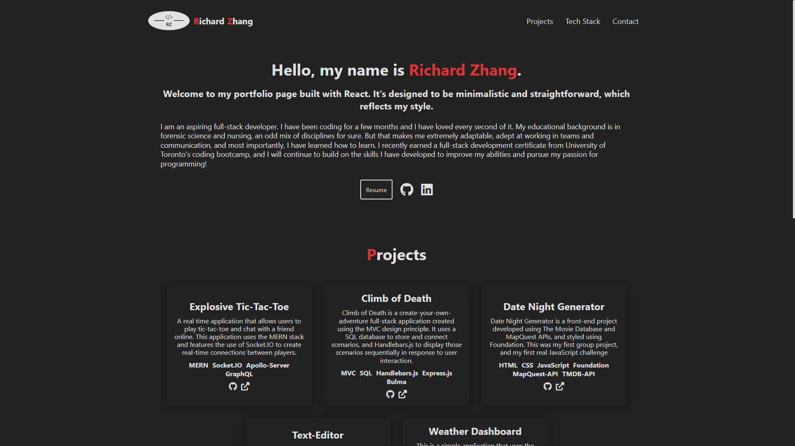
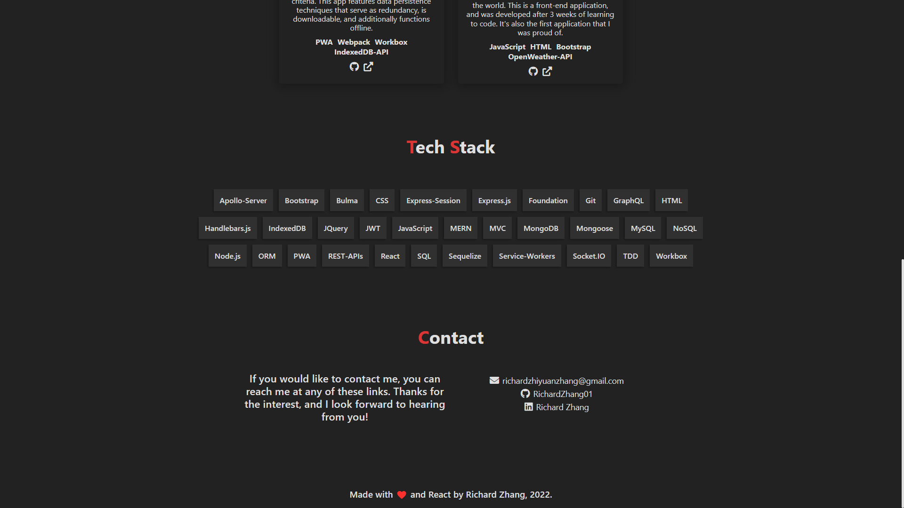

# Richard Zhang's React Portfolio

 

## Description

-  This is my portfolio page created using React. This is a front-end only application that contains information about me, some of my projects, and some of my links. This application is written to be largely reuseable, and most of the information displayed on the page can be easily changed by editing the data.js file in the src/utils folder. So if anyone would like to use this page as a template, feel free. **You can access the portfolio [here](https://richardzhang01.github.io/portfolio/).**

## Table of Contents

1. [Installation](#installation)
2. [Usage](#usage)
3. [Screenshots](#screenshots)
4. [License](#license)
5. [How to Contribute](#how-to-contribute)
6. [Questions?](#questions)

## Installation

To install this portfolio, you can clone this repo. 

If performing a manual installation, you need [Node.js](https://nodejs.org/en/).

To install dependencies, open in [Visual Studio Code](https://code.visualstudio.com/), and in the terminal run: 

      npm install 

## Usage

Once the application is installed and opened in Visual Studio Code, or navigated to using Git Bash (or similar command-line tool), run: 

      npm run start 

The application runs locally on port 3000.

Once the server has been started, in your browser, navigate to http://localhost:3000

Most of the data on the page can be edited in the `data.js` file in the `src/utils` directory. However, there are some parts of the portfolio that is hardcoded, so keep that in mind if you're planning on using this portfolio as a template.

##  Screenshots

## License

This application is covered under the [MIT](https://opensource.org/licenses/MIT) license

----------------------------------------------------------------

  Copyright © 2022 Richard Zhang

  Permission is hereby granted, free of charge, to any person obtaining a copy of this software and associated documentation files (the "Software"), to deal in the Software without restriction, including without limitation the rights to use, copy, modify, merge, publish, distribute, sublicense, and/or sell copies of the Software, and to permit persons to whom the Software is furnished to do so, subject to the following conditions:
  
  The above copyright notice and this permission notice shall be included in all copies or substantial portions of the Software.
  
  THE SOFTWARE IS PROVIDED "AS IS", WITHOUT WARRANTY OF ANY KIND, EXPRESS OR IMPLIED, INCLUDING BUT NOT LIMITED TO THE WARRANTIES OF MERCHANTABILITY, FITNESS FOR A PARTICULAR PURPOSE AND NONINFRINGEMENT. IN NO EVENT SHALL THE AUTHORS OR COPYRIGHT HOLDERS BE LIABLE FOR ANY CLAIM, DAMAGES OR OTHER LIABILITY, WHETHER IN AN ACTION OF CONTRACT, TORT OR OTHERWISE, ARISING FROM, OUT OF OR IN CONNECTION WITH THE SOFTWARE OR THE USE OR OTHER DEALINGS IN THE SOFTWARE.

  ----------------------------------------------------------------

## How to Contribute

If you want to contribute to this project and make it better, your help is very welcome. This was a school project, so anything you want to do to it, go for it. You can also contact me directly through the links below.

## Questions?

Have any questions? Here is a list of our links:

- GitHub: [RichardZhang01](https://github.com/RichardZhang01)
- Email: richardzhiyuanzhang@gmail.com
